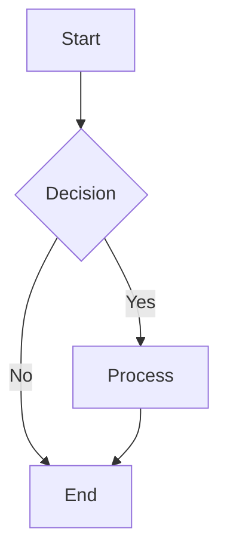
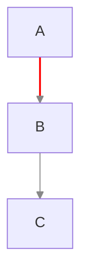
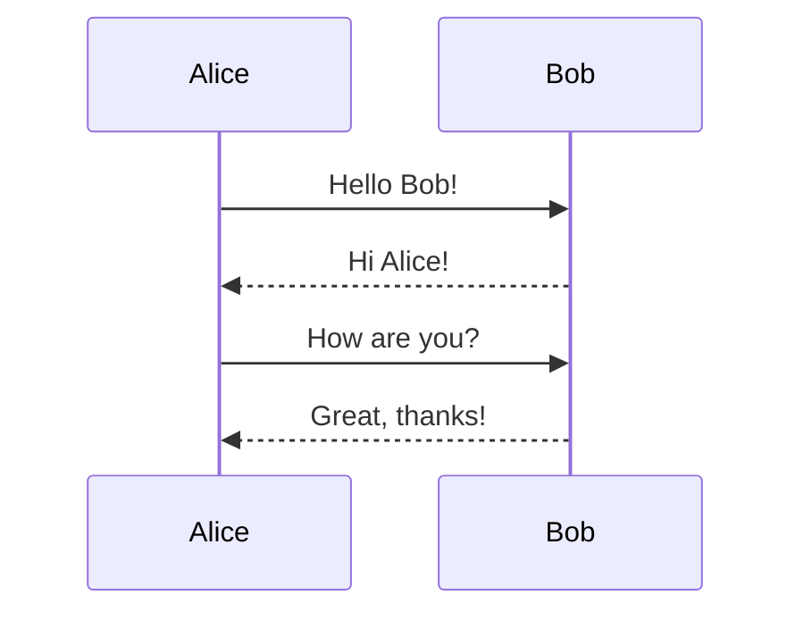
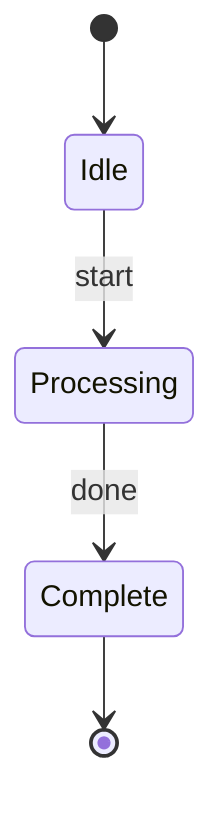
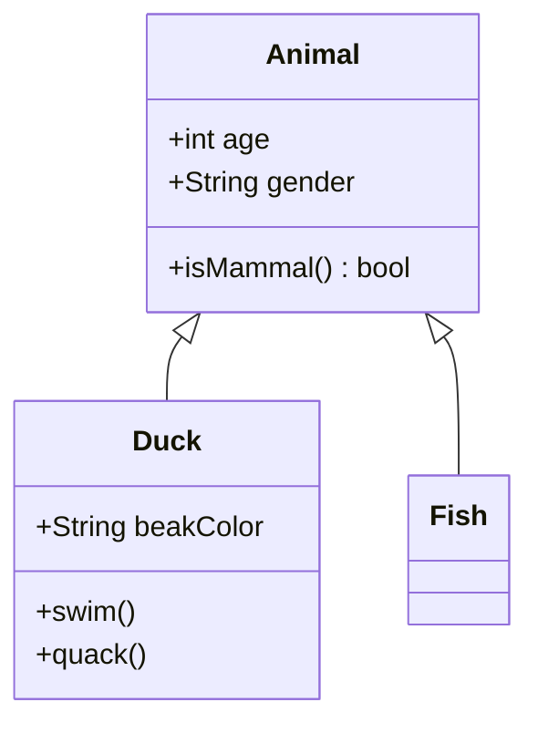
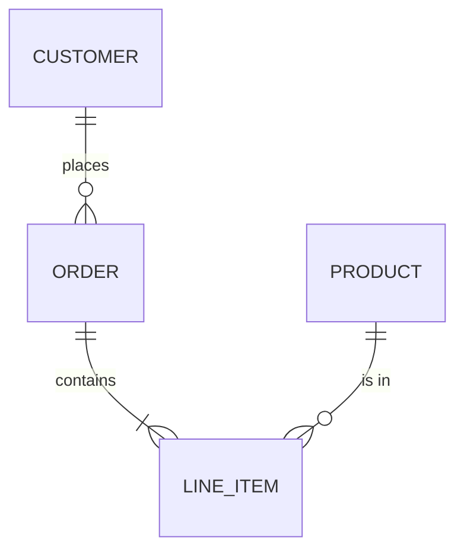
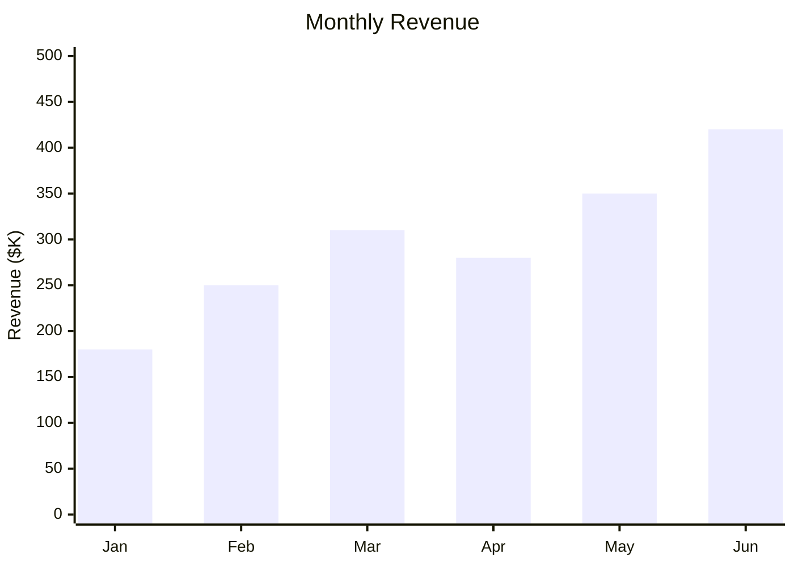
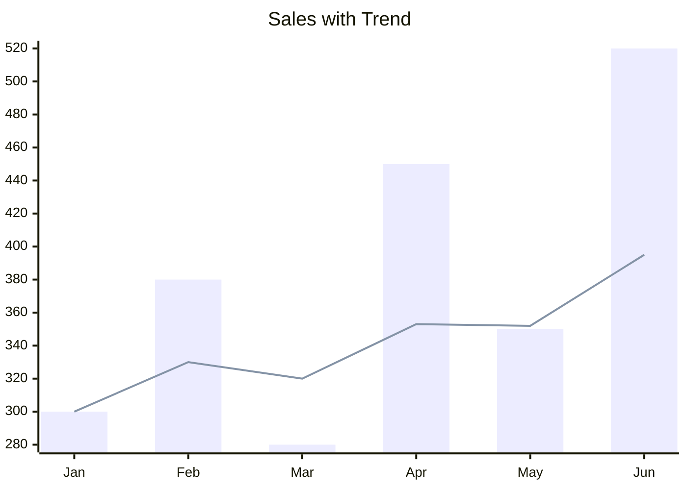
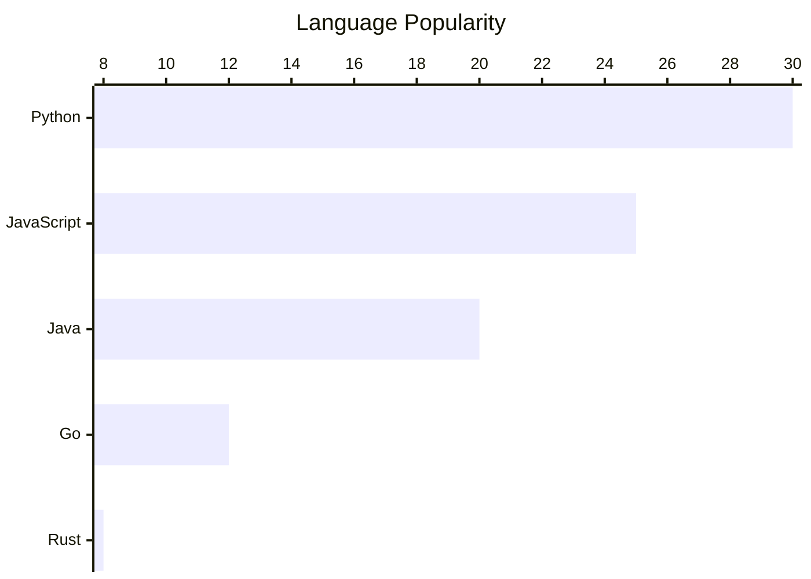

# Diagram Types Reference

## Flowchart

Processes, workflows, decision trees.



**Directions:** `TD` (top-down), `LR` (left-right), `BT`, `RL`.

**Inline edge styling:**


---

## Sequence Diagram

API calls, interactions, message flows.



---

## State Diagram

Application states, lifecycle, FSM.



---

## Class Diagram

Object models, architecture, relationships.



---

## ER Diagram

Database schema, data models.



---

## XY Chart (xychart-beta)

Bar charts, line charts, combinations.

**Bar chart:**


**Line chart:**
```mermaid
xychart-beta
    title "User Growth"
    x-axis [Jan, Feb, Mar, Apr, May, Jun]
    line [1200, 1800, 2500, 3100, 3800, 4500]
```

**Combined:**


**Horizontal:**


**Axis options:**
- Categorical: `x-axis [A, B, C]`
- Numeric range: `x-axis 0 --> 100`
- Titles: `x-axis "Category" [A, B, C]`
- Y-range: `y-axis "Score" 0 --> 100`

**Multi-series:** add multiple `bar` and/or `line` declarations. Each gets a distinct color from a monochromatic accent palette.
